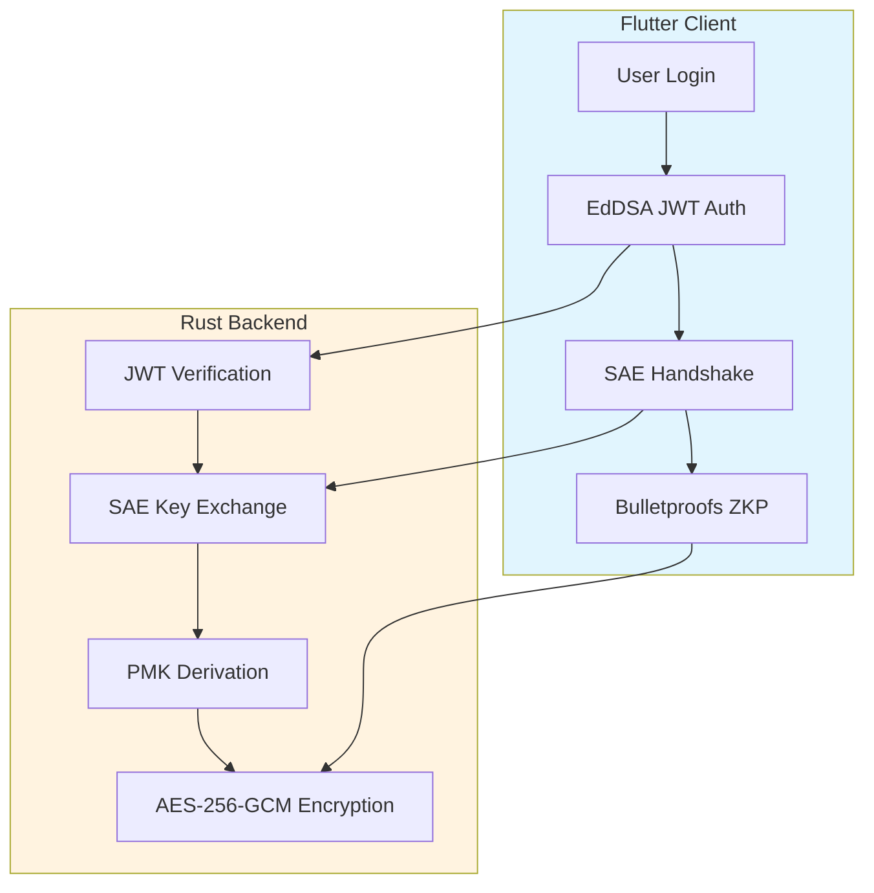
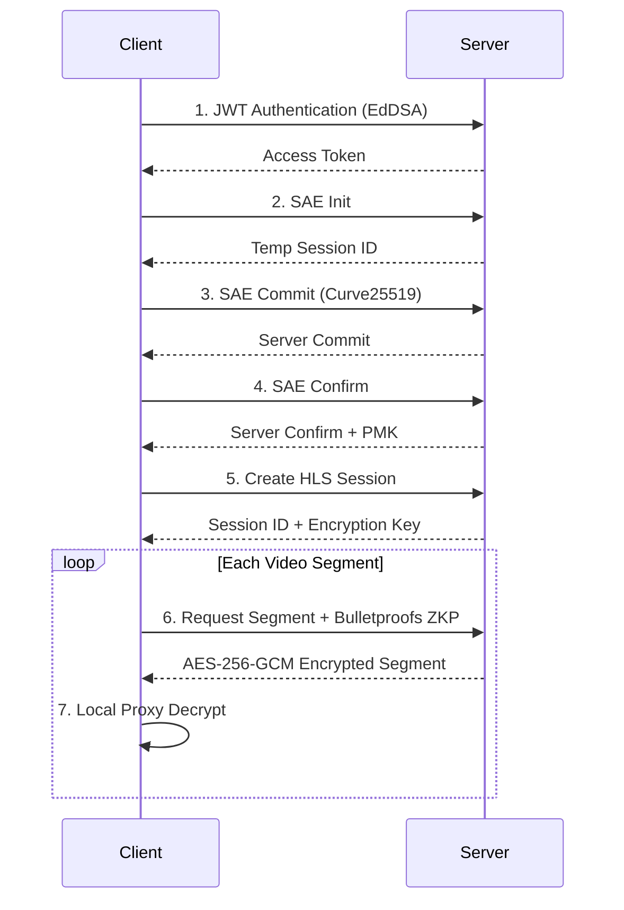
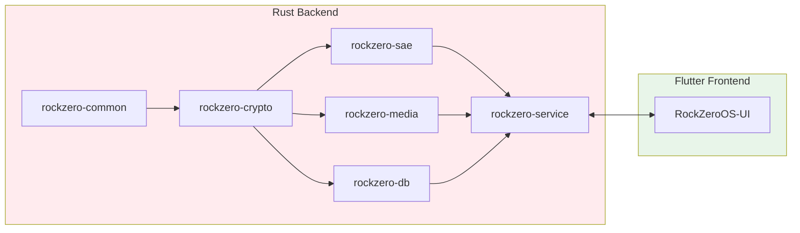
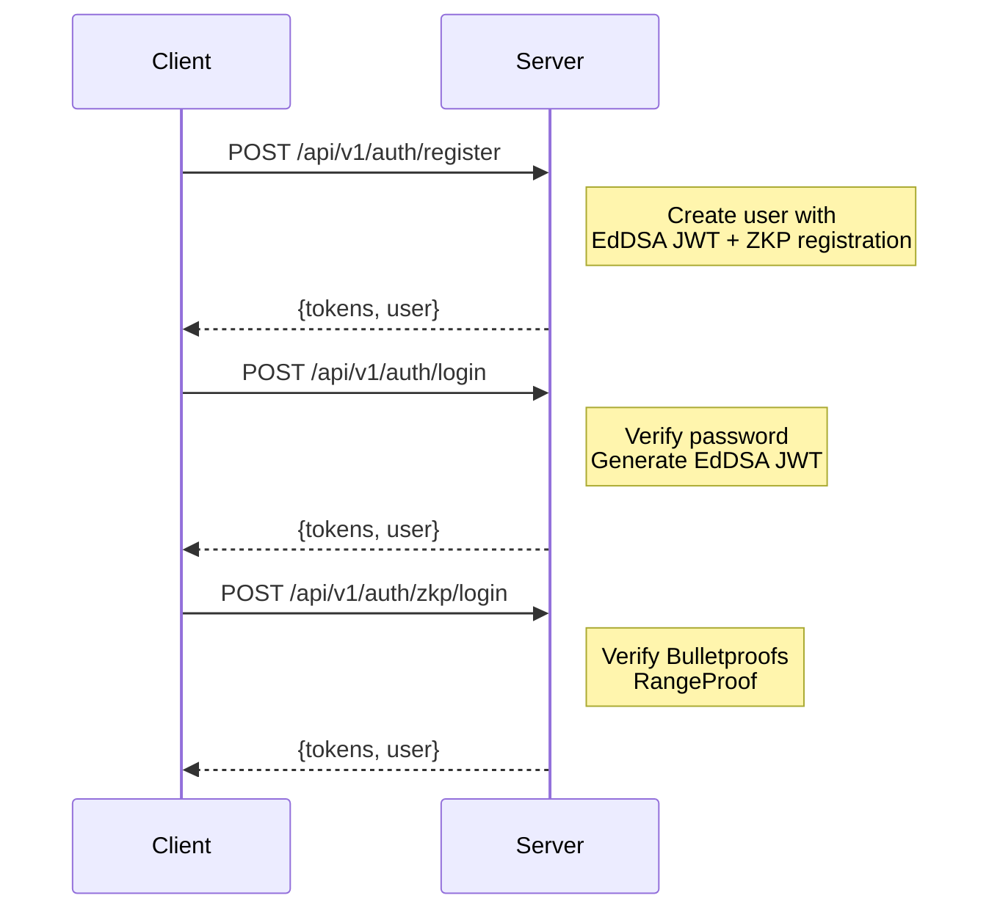

<p align="center">
  
</p>

<h1 align="center">RockZeroOS</h1>

<p align="center">
  <strong>Secure Private Cloud NAS Operating System</strong>
</p>

<p align="center">
  <a href="https://www.rust-lang.org/"></a>
  <a href="https://flutter.dev/"></a>
  <a href="LICENSE"></a>
  
</p>

---

## Overview

RockZeroOS is a high-performance, secure cross-platform private cloud NAS operating system built with Rust. It features military-grade encryption including WPA3-SAE key exchange, EdDSA (Ed25519) JWT authentication, Bulletproofs zero-knowledge proofs, hardware-accelerated video transcoding, and professional storage management.

## Security Architecture



| Feature | Technology | Description |
|---------|------------|-------------|
| JWT Authentication | EdDSA (Ed25519) | Private key derived from BLAKE3 hash of password |
| Key Exchange | WPA3-SAE (Dragonfly) | Secure key negotiation based on Curve25519 |
| Zero-Knowledge Proof | Bulletproofs RangeProof | Prove password knowledge without revealing it |
| Video Encryption | AES-256-GCM | Each HLS segment independently encrypted |
| Replay Protection | Timestamp + Nonce + HMAC | Multi-layer protection mechanism |
| Hardware Auth | FIDO2/WebAuthn | Support for YubiKey, TouchID, FaceID |
| Secure Storage | Reed-Solomon + CRC32 | Data integrity verification and error correction |

## Secure HLS Video Streaming



## Storage Management

- **Smart Formatting** - Auto-select optimal filesystem based on usage
  - System boot: ext4
  - Media library: XFS (large file optimization)
  - Database: ext4 (journal optimization)
  - Backup: Btrfs (snapshot support)
  - Cross-platform: exFAT/NTFS
- **Auto Mount** - Smart mount point generation with UUID/Label recognition
- **Partition Management** - GPT/MBR partition table creation
- **Disk Health** - SMART data monitoring, temperature detection
- **Secure Erase** - Multi-pass overwrite for data destruction

## Hardware Accelerated Transcoding

| Platform | Acceleration | Encoder | Decoder |
|----------|--------------|---------|---------|
| NVIDIA | NVENC/NVDEC | h264_nvenc, hevc_nvenc | h264_cuvid, hevc_cuvid |
| Intel | QSV/VAAPI | h264_qsv, hevc_qsv | h264_qsv, hevc_qsv |
| AMD | VAAPI | h264_vaapi, hevc_vaapi | - |
| ARM | V4L2 M2M | h264_v4l2m2m | h264_v4l2m2m |
| Amlogic | V4L2 M2M | h264_v4l2m2m | h264_v4l2m2m |

## Project Structure



```
RockZeroOS-Service/
├── rockzero-common/          # Common library (error handling, config, types)
├── rockzero-crypto/          # Cryptography library
│   ├── jwt.rs                # EdDSA JWT (Ed25519 + BLAKE3)
│   ├── ed25519.rs            # Ed25519 signatures
│   ├── bulletproofs_ffi.rs   # Bulletproofs RangeProof
│   ├── zkp.rs                # ZKP authentication
│   ├── aes.rs                # AES-256-GCM encryption
│   └── hash.rs               # BLAKE3, SHA3-256
├── rockzero-sae/             # WPA3-SAE key exchange
│   ├── client.rs             # SAE client
│   ├── server.rs             # SAE server
│   └── crypto.rs             # Curve25519 cryptography
├── rockzero-media/           # Media processing
│   ├── session.rs            # HLS session management
│   ├── encryptor.rs          # AES-256-GCM video encryption
│   └── bulletproof_auth.rs   # Video segment ZKP auth
├── rockzero-db/              # Database (SQLite + Reed-Solomon)
├── rockzero-service/         # Main service
│   └── handlers/
│       ├── auth.rs           # EdDSA JWT authentication
│       ├── zkp_auth.rs       # ZKP authentication
│       ├── secure_hls.rs     # Secure HLS streaming
│       └── ...
└── RockZeroOS-UI/            # Flutter cross-platform client
    └── lib/
        ├── services/
        │   ├── bulletproofs_ffi.dart
        │   ├── sae_client_curve25519.dart
        │   └── secure_hls_player.dart
        └── features/
            ├── auth/
            ├── files/
            └── ...
```

## Quick Start

### Prerequisites

- Rust 1.90+
- FFmpeg 6.0+
- SQLite 3.x
- Flutter 3.19+

### Build Backend

```bash
git clone https://github.com/blueokanna/rockzero-service.git
cd rockzero-service

cargo build --workspace --release
cargo test --workspace
cargo run -p rockzero-service --release
```

### Configuration

Create `.env` file:

```env
HOST=0.0.0.0
PORT=8080
RUST_LOG=info

DATA_DIR=./data
DATABASE_URL=./data/rockzero.db

JWT_SECRET=your-super-secret-jwt-key-change-this-in-production
JWT_EXPIRATION_HOURS=24
REFRESH_TOKEN_EXPIRATION_DAYS=7

STORAGE_ROOT=/mnt/storage
MAX_UPLOAD_SIZE=10737418240
HLS_CACHE_PATH=./data/hls_cache
```

### Run Flutter Client

```bash
cd RockZeroOS-UI
flutter pub get
flutter run
```

## API Reference

### Authentication



### Secure HLS

```http
POST /api/v1/secure-hls/sae/init
POST /api/v1/secure-hls/sae/commit
POST /api/v1/secure-hls/sae/confirm
POST /api/v1/secure-hls/session/create
POST /api/v1/secure-hls/{session_id}/segment_{n}.ts
```

### ZKP

```http
POST /api/v1/zkp/range-proof/create
POST /api/v1/zkp/range-proof/verify
POST /api/v1/zkp/video/proof
POST /api/v1/zkp/video/verify
```

## Performance

| Operation | Performance |
|-----------|-------------|
| EdDSA JWT Sign | ~0.1ms |
| EdDSA JWT Verify | ~0.2ms |
| SAE Handshake | ~5-10ms |
| Bulletproofs RangeProof | ~50ms |
| AES-256-GCM Encryption | ~500 MB/s |
| BLAKE3 Hash | ~1 GB/s |
| Hardware Transcode (NVENC) | ~300 FPS (1080p) |
| Hardware Transcode (QSV) | ~150 FPS (1080p) |

## Docker Deployment

```bash
docker build -t rockzero-service .
docker run -d \
  -p 8080:8080 \
  -v /mnt/storage:/mnt/storage \
  -v ./data:/app/data \
  --name rockzero \
  rockzero-service
```

## Roadmap

- [x] EdDSA (Ed25519) JWT authentication
- [x] WPA3-SAE key exchange
- [x] Bulletproofs RangeProof ZKP
- [x] AES-256-GCM encrypted HLS streaming
- [x] FIDO2/WebAuthn hardware authentication
- [x] Professional storage management
- [x] Hardware accelerated video transcoding
- [x] CasaOS/iStoreOS app store
- [x] Docker container management
- [x] Flutter cross-platform client
- [ ] RAID support
- [ ] Snapshot and backup
- [ ] Multi-user permission management
- [ ] SMB/NFS file sharing
- [ ] Remote access (DDNS, VPN)
- [ ] AI smart album

## License

This project is licensed under AGPL-3.0 - see [LICENSE](LICENSE) for details.

## Dependencies

- [Actix Web](https://actix.rs/) - High-performance web framework
- [Tokio](https://tokio.rs/) - Async runtime
- [ed25519-dalek](https://github.com/dalek-cryptography/ed25519-dalek) - Ed25519 signatures
- [curve25519-dalek](https://github.com/dalek-cryptography/curve25519-dalek) - Curve25519
- [bulletproofs](https://github.com/dalek-cryptography/bulletproofs) - Zero-knowledge proofs
- [blake3](https://github.com/BLAKE3-team/BLAKE3) - Fast hashing
- [FFmpeg](https://ffmpeg.org/) - Media processing
- [Flutter](https://flutter.dev/) - Cross-platform UI

## Contact

- **Author**: blueokanna
- **Email**: blueokanna@gmail.com
- **GitHub**: [https://github.com/blueokanna/rockzero-service](https://github.com/blueokanna/rockzero-service)

---

<p align="center">
  <strong>Made with ❤️ by blueokanna</strong>
</p>

<p align="center">
  Powered by Rust 🦀 | Secured by EdDSA + Bulletproofs 🔐 | Accelerated by Hardware 🚀
</p>
