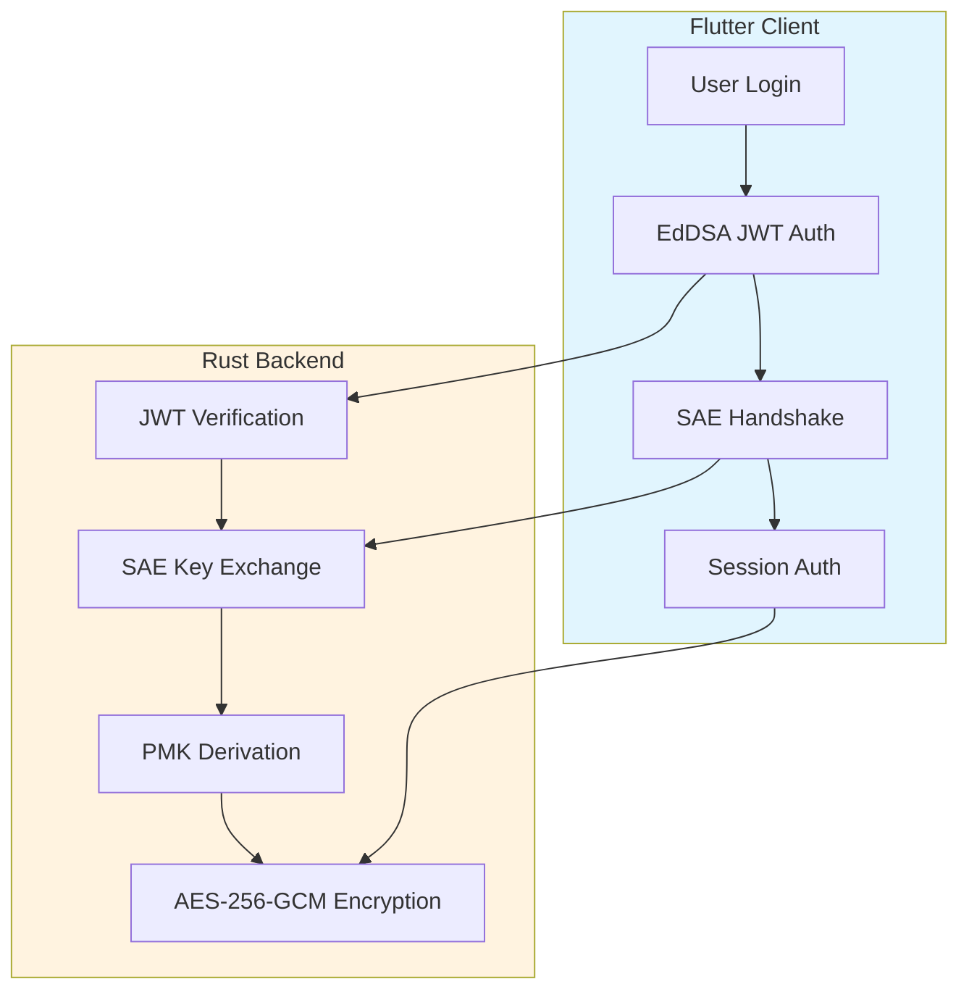
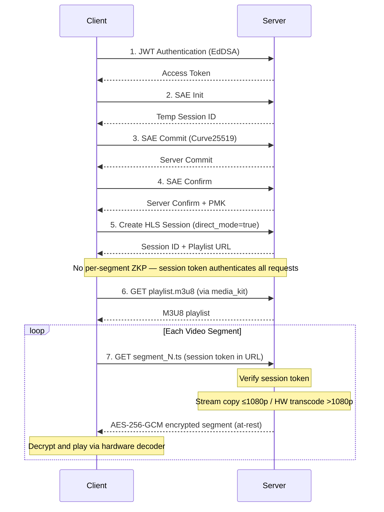
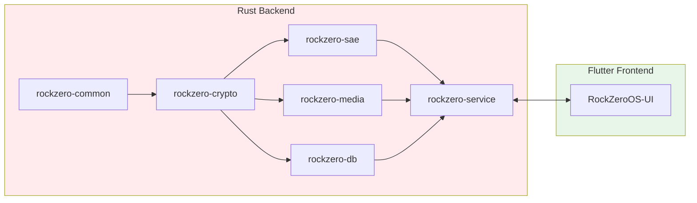
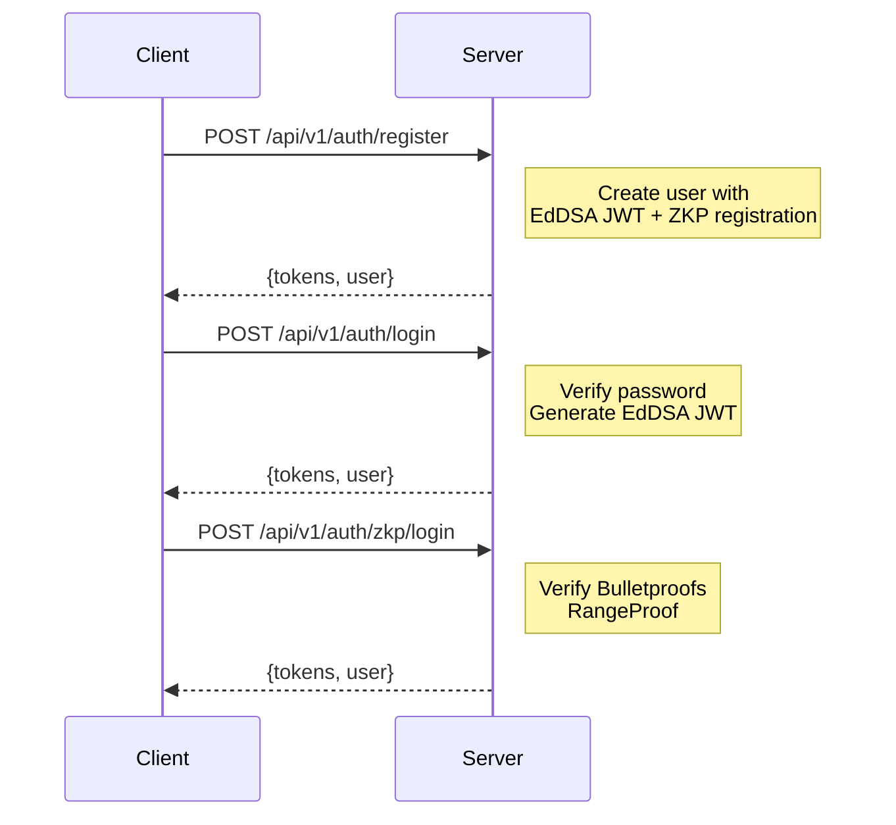

<p align="center">
  
</p>

<h1 align="center">RockZeroOS</h1>

<p align="center">
  <strong>Secure Private Cloud NAS Operating System</strong>
</p>

<p align="center">
  <a href="https://www.rust-lang.org/"></a>
  <a href="https://flutter.dev/"></a>
  <a href="LICENSE"></a>
  
</p>

---

## Overview

RockZeroOS is a high-performance, secure cross-platform private cloud NAS operating system. The backend is built entirely in Rust using Actix-web with military-grade encryption including WPA3-SAE key exchange, EdDSA (Ed25519) JWT authentication, AES-256-GCM encryption, and BLAKE3 integrity verification. The frontend is a Flutter cross-platform client supporting Android, iOS, Windows, macOS, Linux, and Web, with Material Design 3 UI optimized for low-power ARM SoCs (Snapdragon 835 class).

## Features

- **Dashboard** — System overview with CPU, memory, disk, network monitoring, and chronograph-style speed test
- **File Manager** — Browse disks, navigate directories, upload/download files, LAN file transfer, WebDAV, network shares
- **Video Playback** — SAE-encrypted HLS streaming with session-based authentication and AES-256-GCM segment encryption (PMK → HKDF-BLAKE3 → AES-GCM)
- **Game Center** — Multi-platform gaming hub with Steam, Epic Games, WeGame, Ubisoft Connect, Xbox native store integration (no WebView), unified game library, daily Top 30 recommendations, and built-in SteamDB viewer
- **WASM Runtime** — Run WebAssembly applications and scripts via Wasmtime, including built-in SteamDB viewer, M3U8 video downloader, and Steam P2P connection analyzer
- **Storage Management** — Smart formatting (ext4/XFS/Btrfs/exFAT), auto mount, partition management, SMART monitoring, secure erase
- **Hardware Transcoding** — Auto-detected FFmpeg hardware acceleration (VAAPI, V4L2 M2M, Rockchip MPP)
- **Security** — FIDO2/WebAuthn, wallpaper customization with glassmorphic blur (BackdropFilter high-contrast frost), dynamic color (80% wallpaper + 20% system), Reed-Solomon + CRC32 secure storage, Bulletproofs ZKP for authentication
- **Edge-to-Edge UI** — Full-screen gesture navigation support on Android, transparent system bars, predictive back gestures

## Security Architecture


```mermaid
flowchart TB
    subgraph Client["Flutter Client"]
        A[User Login] --> B[EdDSA JWT Auth]
        B --> C[SAE Handshake]
        C --> D[Session Auth]
    end
    
    subgraph Server["Rust Backend"]
        E[JWT Verification] --> F[SAE Key Exchange]
        F --> G[PMK Derivation]
        G --> H[AES-256-GCM Encryption]
    end
    
    B --> E
    C --> F
    D --> H
    
    style Client fill:#e1f5fe
    style Server fill:#fff3e0
```

| Feature | Technology | Description |
|---------|------------|-------------|
| JWT Authentication | EdDSA (Ed25519) | Private key derived from BLAKE3 hash of password |
| Key Exchange | WPA3-SAE (Dragonfly) | Secure key negotiation based on Curve25519 |
| Video Encryption | AES-256-GCM | HLS segments encrypted at rest, session-authenticated playback |
| Session Auth | 128-bit UUID + BLAKE3 HMAC | Direct mode session token per HLS stream |
| Replay Protection | Timestamp + Nonce + HMAC | Multi-layer protection mechanism |
| Zero-Knowledge Proof | Bulletproofs RangeProof | Prove password knowledge without revealing it (auth only) |
| Hardware Auth | FIDO2/WebAuthn | Support for YubiKey, TouchID, FaceID |
| Secure Storage | Reed-Solomon + CRC32 | Data integrity verification and error correction |

## Video Playback Architecture

RockZeroOS uses SAE-encrypted HLS streaming for all video playback. The client performs an SAE handshake, creates a session with `direct_mode: true`, and accesses the playlist URL directly via media_kit without an intermediate proxy. Bulletproofs ZKP is **not** used for video playback; authentication is handled by session tokens.


```mermaid
sequenceDiagram
    participant C as Client
    participant S as Server
    
    C->>S: 1. JWT Authentication (EdDSA)
    S-->>C: Access Token
    
    C->>S: 2. SAE Init
    S-->>C: Temp Session ID
    
    C->>S: 3. SAE Commit (Curve25519)
    S-->>C: Server Commit
    
    C->>S: 4. SAE Confirm
    S-->>C: Server Confirm + PMK
    
    C->>S: 5. Create HLS Session (direct_mode=true)
    S-->>C: Session ID + Playlist URL
    
    Note over C,S: No per-segment ZKP — session token authenticates all requests
    
    C->>S: 6. GET playlist.m3u8 (via media_kit)
    S-->>C: M3U8 playlist
    
    loop Each Video Segment
        C->>S: 7. GET segment_N.ts (session token in URL)
        Note over S: Verify session token
        Note over S: Stream copy ≤1080p / HW transcode >1080p
        S-->>C: AES-256-GCM encrypted segment (at-rest)
        Note over C: Decrypt and play via hardware decoder
    end
```

### Client-side Hardware Decoding

| Platform | API | Configuration |
|----------|-----|---------------|
| Android | MediaCodec | `hwdec=mediacodec` via libmpv |
| iOS | VideoToolbox | `hwdec=videotoolbox` via libmpv |
| Windows/Linux/macOS | Auto-detect | `hwdec=auto-safe` via libmpv |

### Key Derivation

```
PMK (from SAE handshake)
  → HKDF-BLAKE3(salt="hls-session-salt:{session_id}", info="hls-master-key")
  → 256-bit AES-GCM encryption key
```

Each segment is encrypted as: `nonce(12B) ‖ AES-256-GCM(plaintext, key, nonce) ‖ tag(16B)`

## Storage Management

- **Smart Formatting** — Auto-select optimal filesystem based on usage
  - System boot: ext4
  - Media library: XFS (large file optimization)
  - Database: ext4 (journal optimization)
  - Backup: Btrfs (snapshot support)
  - Cross-platform: exFAT/NTFS
- **Auto Mount** — Smart mount point generation with UUID/Label recognition
- **Partition Management** — GPT/MBR partition table creation
- **Disk Health** — SMART data monitoring, temperature detection
- **Secure Erase** — Multi-pass overwrite for data destruction

## Hardware Accelerated Transcoding

The server auto-detects available hardware at startup and selects the optimal encoding pipeline:

| Platform | Detection Method | Encoder | Decoder | Notes |
|----------|-----------------|---------|---------|-------|
| Intel | VAAPI device + vendor ID `0x8086` | h264_vaapi | hwaccel vaapi | Verified via FFmpeg init test |
| AMD | VAAPI device + vendor ID `0x1002` | h264_vaapi | hwaccel vaapi | Verified via FFmpeg init test |
| Amlogic (A311D/S905/S922) | `/proc/cpuinfo`, device tree, `/dev/amvideo` | h264_v4l2m2m | meson_vdec | Falls back to software encode if V4L2 M2M fails |
| Rockchip (RK3588/RK3399) | `/proc/cpuinfo`, device tree | h264_rkmpp | rkmpp | Requires MPP libraries |
| Generic ARM | `/dev/video10`, `/dev/video11` | h264_v4l2m2m | h264_v4l2m2m | Verified via encode test |
| Fallback | — | libx264 (ultrafast) | software | Used when no hardware is detected |

For ≤1080p content, the server uses stream copy (`-c:v copy -c:a copy`) which is near-instant.

## Game Center

Multi-platform gaming hub with **fully native** UI integration (no WebView):

| Platform | Integration | Features |
|----------|-------------|----------|
| Steam | API + SteamDB | Game library, play time stats, profile, API key binding, SteamDB viewer |
| Epic Games | Native catalog (12 games) | Featured carousel, free game highlights, category browsing, search, save to library |
| WeGame | Native catalog (12 games) | Featured carousel, category browsing, search, save to library |
| Ubisoft Connect | Native catalog (11 games) | Featured carousel, category browsing, search, save to library |
| Xbox | Native catalog (11 games) | Featured carousel, Game Pass highlights, category browsing, search, save to library |

The **My Library** tab provides a unified view of game accounts across all platforms with Steam full library integration (game count, total play time, recently played).

The **Daily Top 30** tab shows curated recommendations with 30 games per platform (Steam, Epic, WASM) scored by recency, price, and availability.

### Built-in WASM Applications

| App | Description |
|-----|-------------|
| SteamDB Viewer | Query Steam API for game details: price, online players, reviews, DLC, system requirements |
| M3U8 Downloader | Parse M3U8 playlists, download TS segments, auto-merge with AES decryption support |
| Steam P2P Info | View Steam player profiles, friends list, recent games, and P2P connection details |

## Dynamic Theming & Wallpaper

RockZeroOS supports advanced dynamic theming:

- **Material You** — Seed color from user preference or system accent color
- **Custom Wallpaper** — Set custom wallpaper from gallery; dominant color extracted for theme blending
- **Dynamic Color Blending** — 80% custom wallpaper color + 20% system accent color
- **Glassmorphic Cards** — When wallpaper is active, all cards use frosted glass effect with `BackdropFilter` blur (sigma 20), semi-transparent backgrounds, and subtle border highlighting
- **Edge-to-Edge** — Transparent status bar and navigation bar on Android with predictive back gesture support

## Project Structure


```mermaid
graph LR
    subgraph Backend["Rust Backend"]
        A[rockzero-common] --> B[rockzero-crypto]
        B --> C[rockzero-sae]
        B --> D[rockzero-media]
        B --> E[rockzero-db]
        C --> F[rockzero-service]
        D --> F
        E --> F
    end
    
    subgraph Frontend["Flutter Frontend"]
        G[RockZeroOS-UI]
    end
    
    F <--> G
    
    style Backend fill:#ffebee
    style Frontend fill:#e8f5e9
```

```
RockZeroOS-Service/
├── rockzero-common/              # Common library (error handling, config, types)
├── rockzero-crypto/              # Cryptography library
│   ├── src/
│   │   ├── jwt.rs                # EdDSA JWT (Ed25519 + BLAKE3)
│   │   ├── ed25519.rs            # Ed25519 signature operations
│   │   ├── bulletproofs_ffi.rs   # Bulletproofs RangeProof FFI
│   │   ├── zkp.rs                # ZKP authentication logic
│   │   ├── aes.rs                # AES-256-GCM encryption/decryption
│   │   ├── hash.rs               # BLAKE3, SHA3-256 hashing
│   │   ├── signature.rs          # Digital signatures
│   │   ├── tls.rs                # Rustls TLS configuration
│   │   └── utils.rs              # Crypto utilities
├── rockzero-sae/                 # WPA3-SAE key exchange
│   ├── src/
│   │   ├── client.rs             # SAE client (Curve25519)
│   │   ├── server.rs             # SAE server
│   │   ├── crypto.rs             # Dragonfly key exchange
│   │   ├── key_derivation.rs     # PMK derivation via HKDF
│   │   ├── protocol.rs           # SAE protocol state machine
│   │   └── types.rs              # SAE message types
├── rockzero-media/               # Media processing
│   ├── src/
│   │   ├── session.rs            # HLS session management
│   │   ├── encryptor.rs          # AES-256-GCM video segment encryption
│   │   ├── bulletproof_auth.rs   # Per-segment authentication
│   │   ├── media_processor.rs    # FFmpeg detection & HW capabilities
│   │   ├── chunk_manager.rs      # Progressive chunk management
│   │   ├── playlist.rs           # M3U8 playlist generation
│   │   ├── tcp_stream.rs         # TCP streaming transport
│   │   ├── udp_stream.rs         # UDP streaming transport
│   │   └── secure_transport.rs   # Encrypted transport layer
├── rockzero-db/                  # Database (SQLite + Reed-Solomon)
│   ├── src/
│   │   ├── secure_db.rs          # Encrypted database operations
│   │   ├── operations.rs         # CRUD operations
│   │   └── models.rs             # Database models
├── rockzero-service/             # Main HTTP service (Actix-web)
│   ├── src/
│   │   ├── main.rs               # Server startup, route configuration
│   │   ├── middleware.rs          # JWT auth middleware
│   │   ├── storage_manager.rs    # Disk & mount management
│   │   ├── fido.rs               # FIDO2/WebAuthn handler
│   │   ├── handlers/
│   │   │   ├── auth.rs           # User registration & login (EdDSA JWT)
│   │   │   ├── zkp_auth.rs       # Bulletproofs ZKP authentication
│   │   │   ├── secure_hls.rs     # SAE handshake + encrypted HLS streaming
│   │   │   ├── streaming.rs      # Media info, thumbnails, HLS playlist, audio transcode
│   │   │   ├── filemanager.rs    # File CRUD, upload, download
│   │   │   ├── storage.rs        # Storage overview & disk info
│   │   │   ├── storage_management.rs  # Format, mount, unmount, erase
│   │   │   ├── disk_manager.rs   # Disk detail & SMART
│   │   │   ├── appstore.rs       # WASM app registry
│   │   │   ├── wasm_store.rs     # WASM app store & game APIs
│   │   │   ├── system.rs         # System info (CPU, mem, temp)
│   │   │   ├── speedtest.rs      # Network speed test
│   │   │   ├── lan_transfer.rs   # LAN file transfer
│   │   │   ├── webdav.rs         # WebDAV server
│   │   │   ├── widgets.rs        # Dashboard widgets
│   │   │   └── health.rs         # Health check endpoint
└── RockZeroOS-UI/                # Flutter cross-platform client
    └── lib/
        ├── core/
        │   ├── models/           # API models (DiskInfo, etc.)
        │   ├── network/          # API service, Dio HTTP client
        │   ├── services/         # Wallpaper, media_kit init, dynamic color
        │   ├── theme/            # M3 theme, dynamic color, animation curves
        │   └── widgets/          # ShellScaffold, WallpaperBackground, GlassmorphicBackground, DynamicColorCard
        ├── features/
        │   ├── auth/             # Login, register pages (glassmorphic cards)
        │   ├── dashboard/        # Dashboard, speed test
        │   ├── files/            # File browser, video player
        │   │   └── presentation/pages/
        │   │       ├── files_page.dart             # Disk grid + file listing
        │   │       └── secure_hls_video_player.dart # SAE+HLS video player
        │   ├── appstore/         # Game center
        │   │   └── presentation/
        │   │       ├── pages/
        │   │       │   └── wasm_store_page.dart     # Multi-platform game hub
        │   │       └── widgets/
        │   │           └── platform_game_tab.dart   # Native game tabs (Epic/WeGame/Ubisoft/Xbox)
        │   ├── device_discovery/ # mDNS device discovery
        │   ├── disk/             # Disk formatting & management
        │   ├── storage/          # Storage overview
        │   ├── system/           # System monitoring
        │   └── settings/         # App settings, wallpaper, blur
        └── services/
            ├── sae_client_curve25519.dart    # SAE Dragonfly client
            └── sae_handshake_service.dart    # SAE handshake orchestration
```

## Quick Start

### Prerequisites

- Rust 1.75+ (edition 2021)
- FFmpeg 6.0+ (bundled for ARM64, or system-installed)
- SQLite 3.x
- Flutter 3.19+ with Dart 3.3+

### Build Backend

```bash
git clone https://github.com/blueokanna/rockzero-service.git
cd rockzero-service

cargo build --workspace --release
cargo test --workspace
cargo run -p rockzero-service --release
```

### Configuration

Create `.env` file:

```env
HOST=0.0.0.0
PORT=8080
RUST_LOG=info

DATA_DIR=./data
DATABASE_URL=./data/rockzero.db

JWT_SECRET=your-super-secret-jwt-key-change-this-in-production
JWT_EXPIRATION_HOURS=24
REFRESH_TOKEN_EXPIRATION_DAYS=7

STORAGE_ROOT=/mnt/storage
MAX_UPLOAD_SIZE=10737418240
HLS_CACHE_PATH=./data/hls_cache
```

### Run Flutter Client

```bash
cd RockZeroOS-UI
flutter pub get
flutter run
```

## API Reference

### Authentication


```mermaid
sequenceDiagram
    participant C as Client
    participant S as Server
    
    C->>S: POST /api/v1/auth/register
    Note right of S: Create user with<br/>EdDSA JWT + ZKP registration
    S-->>C: {tokens, user}
    
    C->>S: POST /api/v1/auth/login
    Note right of S: Verify password<br/>Generate EdDSA JWT
    S-->>C: {tokens, user}
    
    C->>S: POST /api/v1/auth/zkp/login
    Note right of S: Verify Bulletproofs<br/>RangeProof
    S-->>C: {tokens, user}
```

### Secure HLS (SAE + AES-256-GCM)

```http
POST /api/v1/secure-hls/sae/init
POST /api/v1/secure-hls/sae/commit
POST /api/v1/secure-hls/sae/confirm
POST /api/v1/secure-hls/session/create
GET  /api/v1/secure-hls/{session_id}/playlist.m3u8
GET  /api/v1/secure-hls/{session_id}/segment_{n}.ts
```

### Media Info & Streaming Utilities

```http
GET  /api/v1/streaming/formats             # Supported media formats
GET  /api/v1/streaming/library             # List media library
GET  /api/v1/streaming/info/{path}         # Get media info (codecs, duration, resolution)
GET  /api/v1/streaming/extended-info/{path} # Extended media info (EXIF, tracks)
GET  /api/v1/streaming/hls/{path}          # Generate HLS playlist
GET  /api/v1/streaming/thumbnail/{path}    # Get video thumbnail
GET  /api/v1/streaming/transcode/{path}    # Audio transcoding
```

### File Manager

```http
GET    /api/v1/filemanager/list?path=...
POST   /api/v1/filemanager/upload
GET    /api/v1/filemanager/download?path=...
GET    /api/v1/filemanager/media/info?path=...
GET    /api/v1/filemanager/media/image?path=...
GET    /api/v1/filemanager/media/thumbnail?path=...
DELETE /api/v1/filemanager/delete
```

### ZKP (Auth only)

```http
POST /api/v1/zkp/search/token
POST /api/v1/zkp/search/execute
POST /api/v1/zkp/share/proof
POST /api/v1/zkp/share/verify
POST /api/v1/zkp/proof/generate
```

### Storage

```http
GET  /api/v1/storage/disks
GET  /api/v1/storage/disk/{name}
POST /api/v1/storage/format
POST /api/v1/storage/mount
POST /api/v1/storage/unmount
```

## Performance

| Operation | Performance | Notes |
|-----------|-------------|-------|
| EdDSA JWT Sign | ~0.1ms | Ed25519 via dalek |
| EdDSA JWT Verify | ~0.2ms | Ed25519 via dalek |
| SAE Handshake (full) | ~5-10ms | Curve25519 Dragonfly |
| Bulletproofs RangeProof | ~50ms | 64-bit range proof (auth only, not video playback) |
| AES-256-GCM Encrypt/Decrypt | ~500 MB/s | Per-segment encryption |
| BLAKE3 Hash | ~1 GB/s | Used for HKDF, HMAC, signatures |
| HLS Segment (stream copy) | <100ms | ≤1080p, no re-encoding |
| HLS Segment (hw transcode) | ~200-500ms | >1080p, VAAPI/V4L2 |
| HLS Segment (sw transcode) | ~1-3s | >1080p, libx264 ultrafast |

## Roadmap

- [x] EdDSA (Ed25519) JWT authentication
- [x] WPA3-SAE key exchange (Curve25519 Dragonfly)
- [x] Bulletproofs RangeProof ZKP (authentication only)
- [x] SAE session-authenticated HLS streaming with AES-256-GCM
- [x] FIDO2/WebAuthn hardware authentication
- [x] Professional storage management
- [x] Hardware accelerated video transcoding
- [x] Flutter cross-platform client
- [x] Multi-platform native game center (Steam/Epic/WeGame/Ubisoft/Xbox)
- [x] LAN file transfer
- [x] WebDAV server
- [x] WASM application runtime (with built-in SteamDB viewer, M3U8 downloader, Steam P2P info)
- [x] Dynamic theming with wallpaper color extraction & glassmorphic UI
- [x] Edge-to-edge UI with gesture navigation
- [ ] RAID support
- [ ] Snapshot and backup
- [ ] Multi-user permission management
- [ ] SMB/NFS file sharing
- [ ] Remote access (DDNS, VPN)
- [ ] AI smart album

## Dependencies

### Rust Backend

- [Actix Web](https://actix.rs/) — High-performance async web framework
- [Tokio](https://tokio.rs/) — Async runtime
- [SQLx](https://github.com/launchbadge/sqlx) — Async SQLite driver
- [ed25519-dalek](https://github.com/dalek-cryptography/ed25519-dalek) — Ed25519 signatures
- [curve25519-dalek](https://github.com/dalek-cryptography/curve25519-dalek) — Curve25519 operations
- [bulletproofs](https://github.com/dalek-cryptography/bulletproofs) — Zero-knowledge proofs
- [blake3](https://github.com/BLAKE3-team/BLAKE3) — Fast cryptographic hashing
- [aes-gcm](https://github.com/RustCrypto/AEADs) — AES-256-GCM encryption
- [Wasmtime](https://wasmtime.dev/) — WebAssembly runtime
- [Rustls](https://github.com/rustls/rustls) — TLS implementation
- [FFmpeg](https://ffmpeg.org/) — Media transcoding (external binary)

### Flutter Frontend

- [Riverpod](https://riverpod.dev/) — State management
- [go_router](https://pub.dev/packages/go_router) — Navigation
- [media_kit](https://github.com/media-kit/media-kit) — Video playback (mpv)
- [flutter_animate](https://pub.dev/packages/flutter_animate) — Animations
- [flutter_secure_storage](https://pub.dev/packages/flutter_secure_storage) — Secure credential storage

## License

This project is licensed under the **GNU Affero General Public License v3.0 (AGPL-3.0)**.

See [LICENSE](LICENSE) for the full license text.

## Contact

- **Author**: blueokanna
- **Email**: blueokanna@gmail.com
- **GitHub**: [https://github.com/blueokanna/rockzero-service](https://github.com/blueokanna/rockzero-service)

---

<p align="center">
  <strong>Made with ❤️ by blueokanna</strong>
</p>

<p align="center">
  Powered by Rust 🦀 | Secured by EdDSA + SAE + AES-256-GCM 🔐 | Accelerated by Hardware 🚀
</p>
