<p align="center">
  
</p>

<h1 align="center">RockZeroOS</h1>

<p align="center">
  <strong>Secure Private Cloud NAS Operating System</strong>
</p>

<p align="center">
  <a href="https://www.rust-lang.org/"></a>
  <a href="https://flutter.dev/"></a>
  <a href="LICENSE"></a>
  
</p>

---

## Overview

RockZeroOS is a high-performance, secure cross-platform private cloud NAS operating system built with Rust. It features military-grade encryption including WPA3-SAE key exchange, EdDSA (Ed25519) JWT authentication, Bulletproofs zero-knowledge proofs, hardware-accelerated video transcoding, and professional storage management.

## Security Architecture


| Feature | Technology | Description |
|---------|------------|-------------|
| JWT Authentication | EdDSA (Ed25519) | Private key derived from BLAKE3 hash of password |
| Key Exchange | WPA3-SAE (Dragonfly) | Secure key negotiation based on Curve25519 |
| Zero-Knowledge Proof | Bulletproofs RangeProof | Prove password knowledge without revealing it |
| Video Encryption | AES-256-GCM | Each HLS segment independently encrypted |
| Replay Protection | Timestamp + Nonce + HMAC | Multi-layer protection mechanism |
| Hardware Auth | FIDO2/WebAuthn | Support for YubiKey, TouchID, FaceID |
| Secure Storage | Reed-Solomon + CRC32 | Data integrity verification and error correction |

## Secure HLS Video Streaming

```mermaid
sequenceDiagram
    participant C as Client
    participant P as Local Proxy
    participant S as Server
    
    C->>S: 1. JWT Authentication (EdDSA)
    S-->>C: Access Token
    
    C->>S: 2. SAE Init
    S-->>C: Temp Session ID
    
    C->>S: 3. SAE Commit (Curve25519)
    S-->>C: Server Commit
    
    C->>S: 4. SAE Confirm
    S-->>C: Server Confirm + PMK
    
    C->>S: 5. Create HLS Session
    S-->>C: Session ID + Key Verification Hash
    
    Note over C,P: Client derives encryption key via HKDF-BLAKE3(PMK)
    C->>P: 6. Start local proxy (127.0.0.1)
    P->>S: 7. GET playlist.m3u8
    S-->>P: M3U8 playlist (VOD, 6s segments)
    
    loop Each Video Segment
        P->>S: 8. POST segment_N.ts + HMAC signature
        Note over S: Verify timestamp + nonce + BLAKE3 HMAC
        Note over S: Transcode on-demand (stream copy ≤1080p)
        S-->>P: AES-256-GCM encrypted segment (nonce‖ciphertext‖tag)
        Note over P: Decrypt in background isolate
        P-->>C: Decrypted MPEG-TS segment
    end
    
    Note over P: Prefetch next 10 segments (4 concurrent)
    Note over P: LRU cache (100 segments max)
```



### Video Pipeline Architecture

The HLS streaming system is designed for low-latency, secure playback on mobile and desktop:

**Server-side (Rust)**
- On-demand transcoding with FFmpeg: stream copy (`-c:v copy -c:a copy`) for ≤1080p sources, hardware-accelerated re-encoding for >1080p
- Hardware acceleration auto-detection: VAAPI (Intel/AMD), V4L2 M2M (Amlogic A311D/S905/S922), Rockchip MPP (RK3588), with cached detection result
- Atomic segment caching: writes to `.tmp` file first, then renames to prevent serving incomplete data
- Background prefetch: pre-transcodes next 5 segments ahead with 3 concurrent tasks
- Replay protection: timestamp validation (±30s drift), nonce uniqueness, BLAKE3 HMAC request signing

**Client-side (Flutter)**
- Local HTTP proxy on `127.0.0.1` decrypts segments before feeding to the player
- AES-256-GCM decryption offloaded to background isolate via `compute()` for segments >64KB
- LRU segment cache (100 entries) with concurrent prefetch (10 ahead, 3 behind, 4 parallel)
- media_kit (libmpv) player with platform-specific hardware decoding:
  - Android: MediaCodec (`hwdec=mediacodec`)
  - iOS: VideoToolbox (`hwdec=videotoolbox`)
  - Desktop: auto-detect (`hwdec=auto-safe`)
- Optimized buffer: 32MB buffer, 30s cache window, high-resolution seeking with frame drop

**Key Derivation**
```
PMK (from SAE handshake)
  → HKDF-BLAKE3(salt="hls-session-salt:{session_id}", info="hls-master-key")
  → 256-bit AES-GCM encryption key
```

Each segment is encrypted as: `nonce(12B) ‖ AES-256-GCM(plaintext, key, nonce) ‖ tag(16B)`

## Storage Management

- **Smart Formatting** - Auto-select optimal filesystem based on usage
  - System boot: ext4
  - Media library: XFS (large file optimization)
  - Database: ext4 (journal optimization)
  - Backup: Btrfs (snapshot support)
  - Cross-platform: exFAT/NTFS
- **Auto Mount** - Smart mount point generation with UUID/Label recognition
- **Partition Management** - GPT/MBR partition table creation
- **Disk Health** - SMART data monitoring, temperature detection
- **Secure Erase** - Multi-pass overwrite for data destruction

## Hardware Accelerated Transcoding

The server auto-detects available hardware at startup (cached for the process lifetime) and selects the optimal encoding pipeline:

| Platform | Detection Method | Encoder | Decoder | Notes |
|----------|-----------------|---------|---------|-------|
| Intel | VAAPI device + vendor ID `0x8086` | h264_vaapi | hwaccel vaapi | Verified via FFmpeg init test |
| AMD | VAAPI device + vendor ID `0x1002` | h264_vaapi | hwaccel vaapi | Verified via FFmpeg init test |
| Amlogic (A311D/S905/S922) | `/proc/cpuinfo`, device tree, `/dev/amvideo` | h264_v4l2m2m | meson_vdec | Falls back to software encode if V4L2 M2M fails |
| Rockchip (RK3588/RK3399) | `/proc/cpuinfo`, device tree | h264_rkmpp | rkmpp | Requires MPP libraries |
| Generic ARM | `/dev/video10`, `/dev/video11` | h264_v4l2m2m | h264_v4l2m2m | Verified via encode test |
| Fallback | — | libx264 (ultrafast) | software | Used when no hardware is detected |

For ≤1080p content, the server uses stream copy (`-c:v copy -c:a copy`) which is near-instant regardless of hardware.

### Client-side Hardware Decoding

| Platform | API | Configuration |
|----------|-----|---------------|
| Android | MediaCodec | `hwdec=mediacodec` via libmpv |
| iOS | VideoToolbox | `hwdec=videotoolbox` via libmpv |
| Windows/Linux/macOS | Auto-detect | `hwdec=auto-safe` via libmpv |

## Project Structure


```
RockZeroOS-Service/
├── rockzero-common/          # Common library (error handling, config, types)
├── rockzero-crypto/          # Cryptography library
│   ├── jwt.rs                # EdDSA JWT (Ed25519 + BLAKE3)
│   ├── ed25519.rs            # Ed25519 signatures
│   ├── bulletproofs_ffi.rs   # Bulletproofs RangeProof
│   ├── zkp.rs                # ZKP authentication
│   ├── aes.rs                # AES-256-GCM encryption
│   └── hash.rs               # BLAKE3, SHA3-256
├── rockzero-sae/             # WPA3-SAE key exchange
│   ├── client.rs             # SAE client
│   ├── server.rs             # SAE server
│   └── crypto.rs             # Curve25519 cryptography
├── rockzero-media/           # Media processing
│   ├── session.rs            # HLS session management
│   ├── encryptor.rs          # AES-256-GCM video encryption
│   └── bulletproof_auth.rs   # Video segment ZKP auth
├── rockzero-db/              # Database (SQLite + Reed-Solomon)
├── rockzero-service/         # Main service
│   ├── storage_manager.rs    # HLS cache auto-cleanup (30min idle)
│   └── handlers/
│       ├── auth.rs           # EdDSA JWT authentication
│       ├── zkp_auth.rs       # ZKP authentication
│       ├── secure_hls.rs     # Secure HLS streaming + HW accel detection
│       └── ...
└── RockZeroOS-UI/            # Flutter cross-platform client
    └── lib/
        ├── services/
        │   ├── bulletproofs_ffi.dart
        │   ├── sae_client_curve25519.dart
        │   ├── secure_hls_proxy.dart   # Local decrypt proxy + isolate decryption
        │   └── sae_handshake_service.dart
        ├── core/
        │   ├── services/
        │   │   ├── wallpaper_service.dart  # Wallpaper + blur amount provider
        │   │   └── media_kit_initializer.dart
        │   └── widgets/
        │       └── shell_scaffold.dart     # Glassmorphic wallpaper background
        └── features/
            ├── auth/
            ├── files/
            │   └── presentation/pages/
            │       └── secure_hls_video_player.dart  # HW-accelerated player
            ├── dashboard/
            │   └── presentation/pages/
            │       └── speed_test_page.dart  # Chronograph-style speed test
            ├── settings/
            │   └── presentation/pages/
            │       └── settings_page.dart    # Blur intensity slider
            └── ...
```

## Quick Start

### Prerequisites

- Rust 1.75+ (edition 2021)
- FFmpeg 6.0+ (bundled for ARM64, or system-installed)
- SQLite 3.x
- Flutter 3.19+ with Dart 3.3+

### Build Backend

```bash
git clone https://github.com/blueokanna/rockzero-service.git
cd rockzero-service

cargo build --workspace --release
cargo test --workspace
cargo run -p rockzero-service --release
```

### Configuration

Create `.env` file:

```env
HOST=0.0.0.0
PORT=8080
RUST_LOG=info

DATA_DIR=./data
DATABASE_URL=./data/rockzero.db

JWT_SECRET=your-super-secret-jwt-key-change-this-in-production
JWT_EXPIRATION_HOURS=24
REFRESH_TOKEN_EXPIRATION_DAYS=7

STORAGE_ROOT=/mnt/storage
MAX_UPLOAD_SIZE=10737418240
HLS_CACHE_PATH=./data/hls_cache
```

### Run Flutter Client

```bash
cd RockZeroOS-UI
flutter pub get
flutter run
```

## API Reference

### Authentication


### Secure HLS

```http
POST /api/v1/secure-hls/sae/init
POST /api/v1/secure-hls/sae/commit
POST /api/v1/secure-hls/sae/confirm
POST /api/v1/secure-hls/session/create
POST /api/v1/secure-hls/{session_id}/segment_{n}.ts
```

### ZKP

```http
POST /api/v1/zkp/range-proof/create
POST /api/v1/zkp/range-proof/verify
POST /api/v1/zkp/video/proof
POST /api/v1/zkp/video/verify
```

## Performance

| Operation | Performance | Notes |
|-----------|-------------|-------|
| EdDSA JWT Sign | ~0.1ms | Ed25519 via dalek |
| EdDSA JWT Verify | ~0.2ms | Ed25519 via dalek |
| SAE Handshake (full) | ~5-10ms | Curve25519 Dragonfly |
| Bulletproofs RangeProof | ~50ms | 64-bit range proof |
| AES-256-GCM Encrypt/Decrypt | ~500 MB/s | Per-segment encryption |
| BLAKE3 Hash | ~1 GB/s | Used for HKDF, HMAC, signatures |
| HLS Segment (stream copy) | <100ms | ≤1080p, no re-encoding |
| HLS Segment (hw transcode) | ~200-500ms | >1080p, VAAPI/V4L2 |
| HLS Segment (sw transcode) | ~1-3s | >1080p, libx264 ultrafast |
| Client Decrypt (isolate) | ~5-15ms | Per 6s segment, background isolate |
| Prefetch Pipeline | 10 segments ahead | 4 concurrent, ~60s buffer |

## Docker Deployment

```bash
docker build -t rockzero-service .
docker run -d \
  -p 8080:8080 \
  -v /mnt/storage:/mnt/storage \
  -v ./data:/app/data \
  --name rockzero \
  rockzero-service
```

## Roadmap

- [x] EdDSA (Ed25519) JWT authentication
- [x] WPA3-SAE key exchange
- [x] Bulletproofs RangeProof ZKP
- [x] AES-256-GCM encrypted HLS streaming
- [x] FIDO2/WebAuthn hardware authentication
- [x] Professional storage management
- [x] Hardware accelerated video transcoding
- [x] CasaOS/iStoreOS app store
- [x] Docker container management
- [x] Flutter cross-platform client
- [ ] RAID support
- [ ] Snapshot and backup
- [ ] Multi-user permission management
- [ ] SMB/NFS file sharing
- [ ] Remote access (DDNS, VPN)
- [ ] AI smart album

## License

This project is licensed under AGPL-3.0 - see [LICENSE](LICENSE) for details.

## Dependencies

- [Actix Web](https://actix.rs/) - High-performance web framework
- [Tokio](https://tokio.rs/) - Async runtime
- [ed25519-dalek](https://github.com/dalek-cryptography/ed25519-dalek) - Ed25519 signatures
- [curve25519-dalek](https://github.com/dalek-cryptography/curve25519-dalek) - Curve25519
- [bulletproofs](https://github.com/dalek-cryptography/bulletproofs) - Zero-knowledge proofs
- [blake3](https://github.com/BLAKE3-team/BLAKE3) - Fast hashing
- [FFmpeg](https://ffmpeg.org/) - Media processing
- [Flutter](https://flutter.dev/) - Cross-platform UI

## Contact

- **Author**: blueokanna
- **Email**: blueokanna@gmail.com
- **GitHub**: [https://github.com/blueokanna/rockzero-service](https://github.com/blueokanna/rockzero-service)

---

<p align="center">
  <strong>Made with ❤️ by blueokanna</strong>
</p>

<p align="center">
  Powered by Rust 🦀 | Secured by EdDSA + Bulletproofs 🔐 | Accelerated by Hardware 🚀
</p>
