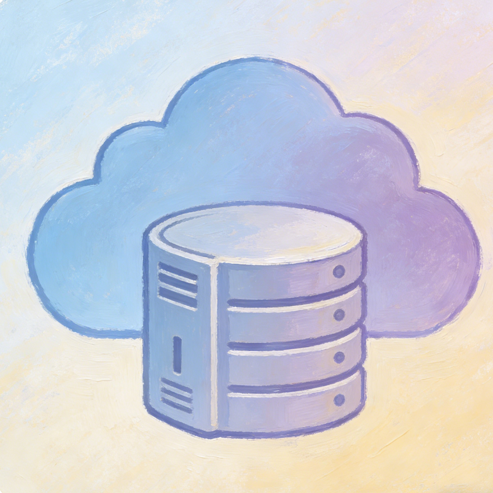

<p align="center">
  
</p>

<h1 align="center">RockZeroOS</h1>

<p align="center">
  <strong>安全的私有云 NAS 操作系统</strong>
</p>

<p align="center">
  <a href="https://www.rust-lang.org/"></a>
  <a href="https://flutter.dev/"></a>
  <a href="LICENSE"></a>
  
</p>

<p align="center">
  <a href="README.md">English</a> · <a href="README.zh-CN.md">简体中文</a>
</p>

---

## 概述

RockZeroOS 是一套以 Rust 后端和 Flutter 前端实现的高性能私有云 NAS 系统。后端基于 Actix-web，负责认证、文件管理、媒体处理、硬件加速转码、游戏中心聚合、WASM 运行时与系统信息采集；前端采用 Flutter 构建，支持 Android、iOS、Windows、macOS、Linux 与 Web，并使用 Material Design 3 作为视觉与交互基线。当前安全视频播放链路使用 WPA3-SAE 协商 PMK、HKDF-BLAKE3 派生会话密钥，并通过 ChaCha20-Poly1305 传输加密 HLS 分段。

当前代码库的重点方向是生产环境一致性：

- Windows 与 Linux 使用不同但清晰受控的存储策略。
- 安全视频播放走 SAE + 会话令牌 + 受控 HLS 链路。
- 游戏中心优先使用实时官方数据，失败时回退到内置目录。
- 仪表盘测速与应用页动画针对低性能设备做了平滑化处理。
- 客户端根部已接入简体中文与英文本地化能力，可继续扩展法语、德语、西班牙语、意大利语、荷兰语。

## 主要特性

- 仪表盘：系统总览、CPU/内存/磁盘/网络监控、表盘式测速、平滑化下载/上传实时动画。
- 文件管理：目录浏览、上传/下载、重命名、复制、移动、删除、文本预览与保存、局域网传输。
- 安全视频播放：SAE 握手、会话化 HLS、本地 Flutter 代理、proof-ticket / ZKP 受控分段访问、ChaCha20-Poly1305 传输加密、按编码类型动态超时、非零 PTS 偏移修正。
- 音频播放：多级回退播放源、后台播放、小窗控制、服务端不兼容编解码自动转码。
- 游戏中心：Steam、Epic Games、WeGame、Ubisoft Connect、Xbox 原生聚合页，无 WebView 依赖。
- WASM 运行时：支持 WebAssembly 应用与脚本执行，并内置 SteamDB 查看器、M3U8 下载器、Steam P2P 分析器。
- 存储管理：Linux 支持磁盘生命周期管理；Windows 使用单根目录绑定与作用域文件操作模型。
- 安全能力：Ed25519 JWT、WPA3-SAE、ChaCha20-Poly1305、BLAKE3、FIDO2/WebAuthn、Reed-Solomon + CRC32。
- 界面能力：动态主题、壁纸混色、玻璃拟态效果、MD3 组件、低动效路由过渡。

## 安全架构

RockZeroOS 的安全链路以用户认证、密钥协商、会话授权和传输保护为主线：

- JWT 认证使用 EdDSA（Ed25519）。
- SAE 握手用于协商 PMK。
- HLS 播放会话基于 PMK 派生 ChaCha20-Poly1305 传输密钥。
- 视频播放使用会话令牌而不是逐片段 ZKP。
- Bulletproofs ZKP 仅用于认证链路，不用于媒体播放。

| 能力 | 技术 | 说明 |
|------|------|------|
| 用户认证 | EdDSA / Ed25519 | 密码派生私钥，JWT 走非对称签名 |
| 密钥协商 | WPA3-SAE | 基于 Curve25519 的安全协商 |
| 视频传输加密 | ChaCha20-Poly1305 | HLS 分段走会话密钥传输加密 |
| HLS 临时缓存保护 | 可选静态加密 | 非 Windows 默认开启，Windows 默认关闭以保证稳定播放 |
| 会话鉴权 | UUID + BLAKE3 HMAC | 每条 HLS 播放链路使用独立会话 |
| 防重放 | 时间戳 + Nonce + HMAC | 降低请求重放风险 |
| 零知识认证 | Bulletproofs RangeProof | 用于认证，不参与视频播放 |
| 硬件认证 | FIDO2 / WebAuthn | 支持安全密钥、生物识别 |
| 存储完整性 | Reed-Solomon + CRC32 | 数据纠错与完整性校验 |

## 视频播放架构

所有视频播放统一使用 SAE 加密 HLS：

1. 客户端先完成 JWT 登录。
2. 客户端发起 SAE 初始化、提交、确认。
3. 服务端返回 PMK 相关上下文。
4. 客户端创建 `direct_mode: false` 的 HLS 会话。
5. Flutter 本地 secure HLS 代理接管播放列表与分段请求。
6. 客户端通过 proof-ticket 或 ZKP 访问分段。
7. 服务端验证会话与 proof-ticket / ZKP 后输出 ChaCha20-Poly1305 加密分段。

关键实现点：

- `media_kit` 默认开启硬件解码。
- 针对 MKV 非零起始时间，客户端与服务端均做时间戳归一化。
- H.264/HEVC 首段超时较短，AV1/VP9 首段超时更长。
- 当用户拖动到远端时间点时，服务端支持按需生成目标分段。
- 在 Windows 作用域存储模式下，`filemanager` 与 `secure_hls` 共用同一根目录约束，避免文件列表可见但播放 404 的路径不一致问题。
- Windows 下默认关闭 HLS 临时缓存静态加密，只保留会话传输加密，避免播放过程中后端异常退出。

### 客户端硬件解码

Flutter 客户端通过 `media_kit` / `libmpv` 进行解码，默认优先硬件路径：

- Android：MediaCodec
- iOS：VideoToolbox
- Windows / Linux / macOS：`hwdec=auto-safe`

播放器默认启用：

- `rebase-start-time=yes`
- `demuxer-lavf-o=fflags=+genpts+discardcorrupt`
- `cache=yes`
- `stream-buffer-size=2MiB`

### 音频播放

音频使用三层回退策略：

1. `LockCachingAudioSource`
2. 带鉴权头的 `AudioSource.uri`
3. `setUrl`

后退键默认将全屏音频最小化到小窗，而不是直接停止。显式停止通过专门的停止按钮执行。

## 存储管理

### Linux 模式

Linux 侧支持完整磁盘生命周期能力：

- 文件系统格式化
- GPT / MBR 分区表创建
- 自动挂载
- SMART 健康检测
- 安全擦除
- 依据业务类型自动推荐文件系统

### Windows 作用域存储模式

Windows 与 Linux 的能力边界明确不同：

- 不执行整盘格式化、分区、抹盘、自动挂载。
- 仍然暴露磁盘状态、容量、使用率等信息用于 UI 展示。
- 所有文件操作必须限制在一个明确绑定的根目录及其子目录内。
- 根目录绑定结果持久化到 `DATA_DIR/storage/windows-storage-root.json`。
- Android、Windows 等前端都通过同一后端接口使用该作用域配置。
- Windows 下的 secure HLS 播放也受同一根目录约束，并已通过 `secure_hls_playlist_only_smoke_test.dart` 与 `secure_hls_smoke_test.dart` 烟测链路验证。
- `ROCKZERO_HLS_CACHE_AT_REST_ENCRYPTION` 在 Windows 默认是 `false`，在非 Windows 默认是 `true`。

### Windows 首次启动绑定流程

1. 打开文件页。
2. 若后端运行在 Windows 且尚未配置根目录，客户端进入存储配置流程。
3. 前端通过服务端接口浏览盘符与目录树。
4. 用户明确选择某个磁盘上的某个目录作为受管根目录。
5. 服务端写入绑定信息并初始化 `videos`、`temp`、`cache/hls`、`logs`。
6. 之后的浏览、编辑、流媒体播放都只能在该作用域内执行。

### Windows 支持的文件操作

- 浏览目录
- 上传与下载文件
- 新建目录
- 文件与目录重命名
- 文件与目录复制
- 文件与目录移动
- 文件与目录删除
- 文本文件预览与保存
- 媒体流播放
- 磁盘与存储状态读取

任何越过已绑定根目录的请求都会被服务端拒绝。

### Windows 作用域接口

- `GET /api/v1/filemanager/scope/status`
- `GET /api/v1/filemanager/scope/browse`
- `POST /api/v1/filemanager/scope/configure`
- `POST /api/v1/filemanager/text/save`

## 硬件加速转码

服务端启动时会自动检测硬件编码链路，并通过测试编码验证可用性。ARM 平台不会盲目使用 VAAPI，而是优先：

1. Rockchip MPP
2. V4L2 M2M
3. 软件回退

典型策略：

- 小于等于 1080p 时优先 stream copy。
- 需要重编码时自动选择硬件编码器。
- 无可用硬件时回退到 `libx264`。
- 所有 ffmpeg 调用带时间戳归一化参数。
- HLS 缓存默认上限 1 GB，空闲定时清理。

Windows 播放说明：Windows 默认关闭 HLS 临时缓存静态加密，分段传输加密仍然保持开启。如果你需要在 Windows 上强制启用临时缓存静态加密，可设置 `ROCKZERO_HLS_CACHE_AT_REST_ENCRYPTION=true`，但应先在目标环境完成播放验证。

Windows 诊断脚本：可使用 `scripts/secure_hls_playlist_only_diag.ps1` 做 playlist-only 复现。若环境中存在 ProcDump 与 `minidump-stackwalk`，脚本会在 `storage/smoke/playlist_only_diag/<timestamp>/` 下产出 `summary.json`、`procdump.stackwalk.txt`、`procdump.stackwalk.summary.txt` 与 `suspicious_threads.json`。

## 自适应混合传输

安全媒体传输同时使用 UDP 与 TCP：

- 默认比例：UDP 70% + TCP 30%
- UDP 最小 10%，最大 70%
- TCP 最小 30%，最大 90%
- 当丢包率超过阈值时，自动提高 TCP 占比以保证稳定性

默认启动参数针对高吞吐 ARM 设备做了调优：

- `chunk_size`: 128 KiB
- `udp_window_size`: 96
- `send_buffer_size`: 16 MiB
- `tcp_max_retries`: 5
- `udp_loss_threshold`: 3%

## 游戏中心

游戏中心采用原生 Flutter UI，不依赖 WebView。每个平台优先请求官方或公开数据源，失败时回退到内置目录，保证在离线、限网或接口波动时仍能正确展示内容。

| 平台 | 数据源 | 当前能力 |
|------|--------|----------|
| Steam | Steam Web API | 游戏库、游玩时长、资料、API Key 绑定、SteamDB 查看 |
| Epic Games | Epic GraphQL API | 实时目录、免费游戏、精选、分类、搜索 |
| WeGame | WeGame API | 热门游戏、精选、分类、收藏 |
| Ubisoft Connect | Ubisoft Store / Services API | 实时目录、精选、分类、收藏 |
| Xbox | Game Pass Catalog / DisplayCatalog | 实时目录、Game Pass 内容、搜索、收藏 |

近期前端修正包括：

- 当后端地址变化或重新连上设备后，平台页会重新拉取实时数据，而不是一直停留在静态回退目录。
- 长列表逐项入场动画被移除，降低 Android、Windows、Linux 低性能设备上的掉帧风险。
- 游戏中心页头、搜索提示、菜单与主要标签页已接入中英双语。

## 动态主题、动画与本地化

客户端支持：

- 动态主题色
- 壁纸混色
- 玻璃拟态模糊背景
- Material Design 3 组件与曲线时长常量
- 全局轻量路由过渡
- 在系统请求减少动画时退化为无转场

测速页与游戏中心已经做了针对低性能设备的平滑化优化：

- 上传测试改为流式发送，减少 UI 线程阻塞。
- 速度表盘使用更稳定的补间方式，避免重建时跳回零点。
- 列表与标签页取消重型逐项入场动画，优先保证滑动与数值刷新稳定。

当前应用根部已接入简体中文与英文本地化委托，后续可继续扩展更多语言。

## 项目结构

```text
rockzero-common/      共享配置、类型、模型
rockzero-crypto/      加密、签名、JWT、TLS、ZKP
rockzero-db/          数据库模型与安全存储
rockzero-media/       HLS、FFmpeg、混合传输、播放会话
rockzero-sae/         SAE 协议实现
rockzero-service/     Actix-web 服务端与业务处理器
RockZeroOS-UI/        Flutter 多端客户端
scripts/              辅助脚本
data/                 媒体与安全存储数据
storage/              烟测与运行期存储目录
```

## 快速开始

### 前置要求

- Rust 1.75 或更高版本
- Flutter 3.19 或更高版本
- FFmpeg 可执行文件
- 支持的数据库与系统依赖

### 构建后端

```bash
cargo build --release
```

单独构建服务端：

```bash
cargo build -p rockzero-service --bin rockzero-service --release
```

### 配置

常见环境变量：

- `RUST_LOG`
- `ROCKZERO_BIND`
- `ROCKZERO_DATA_DIR`
- `ROCKZERO_JWT_SECRET`
- `ROCKZERO_FFMPEG_PATH`

### 运行 Flutter 客户端

```bash
cd RockZeroOS-UI
flutter pub get
flutter run
```

针对平台的常用命令：

```bash
flutter run -d windows
flutter run -d linux
flutter run -d chrome
flutter run -d android
```

## API 参考

以下接口分类覆盖了当前主流程：

### 认证

- JWT 登录与刷新
- FIDO2 / WebAuthn
- 邀请系统

### 安全 HLS

- SAE 初始化、提交、确认
- 创建 HLS 播放会话
- 拉取 `playlist.m3u8`
- 拉取加密视频分段

### 文件管理

- 目录浏览
- 上传 / 下载
- 文本预览 / 保存
- 作用域状态与配置

### WASM 与游戏中心

- WASM 商店概览
- Steam / Epic / WeGame / Ubisoft / Xbox 聚合数据
- SteamDB 查看器
- 每日推荐与热门内容

### 系统与测速

- CPU / 内存 / 温度 / 磁盘 / 网络
- 速度测试结果上报与实时采样

## 性能说明

RockZeroOS 的实现重点不是堆叠视觉效果，而是在低性能设备上保持稳定：

- 页面转场统一为轻量级 MD3 风格。
- 系统要求减少动画时直接关闭转场。
- 游戏中心列表避免逐项重动画。
- 仪表盘测速尽量减少主线程分配与大块同步操作。
- 媒体链路优先走 stream copy 与硬件编解码。

## 依赖概览

### Rust 后端

- `actix-web`
- `tokio`
- `serde`
- `uuid`
- `blake3`
- `chacha20poly1305`
- `ed25519-dalek`
- `sqlx` 或相关数据库组件

### Flutter 前端

- `flutter_riverpod`
- `go_router`
- `dio`
- `media_kit`
- `media_kit_video`
- `just_audio`
- `flutter_secure_storage`
- `shared_preferences`
- `intl`

## License

本项目采用 AGPL-3.0 许可证。详情请查看 `LICENSE`。

## 英文文档

如果需要英文版完整说明，请查看 [README.md](README.md)。